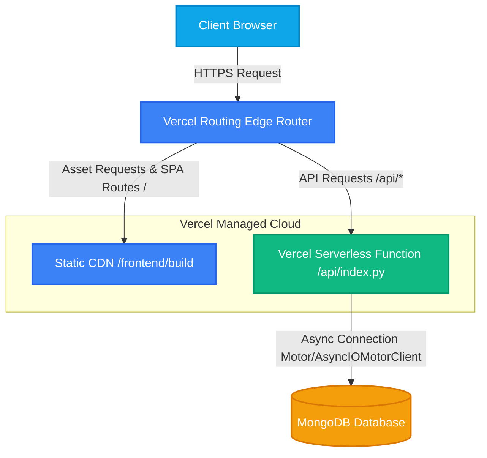
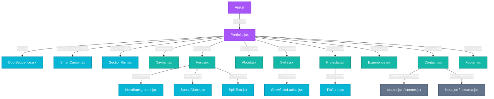

# Repository Architecture & Infrastructure Documentation

This document provides a detailed breakdown of the system architecture, infrastructure deployment model, data flow, and component relationships for Nikhil Thakur's Portfolio Monorepo (`portfolio_v1`).

---

## 1. High-Level System Architecture

The application is structured as a **Serverless Monorepo** optimized for zero-cold-start hosting on Vercel. It consists of a static Single Page Application (SPA) frontend built with **React**, **Tailwind CSS**, and **Framer Motion**, backed by a serverless **FastAPI (Python)** API that interfaces asynchronously with a **MongoDB** database.

---

## 2. Infrastructure & Deployment Model

The workspace is configured to operate in two distinct environments: **Production (Vercel)** and **Local Development**. The routing and deployment behaviors are governed by `vercel.json` in production, and standard port binding in development.

### Production Routing & Builds (Vercel)
Vercel handles the monorepo deployment automatically using the configurations defined in [vercel.json](file:///D:/AI-ML_projects/portfolio_wb/portfolio_v1/vercel.json):
1. **Frontend Builder**: Uses `@vercel/static-build` inside the `frontend` subdirectory. The output is mapped to the `build` directory, and is served on Vercel's global Edge CDN.
2. **Backend Builder**: Uses `@vercel/python` to build and serve [api/index.py](file:///D:/AI-ML_projects/portfolio_wb/portfolio_v1/api/index.py) as an on-demand Serverless Function.

```mermaid
sequenceDiagram
    autonumber
    actor Client as Client Browser
    participant Edge as Vercel Edge Router
    participant CDN as Static Asset CDN (SPA)
    participant Function as Vercel Python Serverless Function
    participant DB as MongoDB Cluster

    rect rgb(10, 15, 25)
        Note over Client, Edge: Static & SPA Flow
        Client->>Edge: Request / (or /static/main.js)
        Edge->>CDN: Resolve to frontend/index.html (or static build)
        CDN-->>Client: Returns SPA Bundle / Static Asset
    end

    rect rgb(15, 25, 20)
        Note over Client, DB: Serverless API Flow
        Client->>Edge: POST /api/status (Payload: client_name)
        Edge->>Function: Invoke api/index.py serverless instance
        Function->>DB: Async insert_one() status checks collection
        DB-->>Function: Insert Acknowledged
        Function-->>Client: 200 OK (StatusCheck Object)
    end
```

---

## 3. Detailed Component Architectures

### 3.1. Frontend Architecture (React SPA)
The frontend utilizes a modern design framework designed for visual excellence, micro-animations, and high-performance interactivity.

- **Build / Tooling**: Managed via `@craco/craco` (Create React App Configuration Override) to configure Tailwind CSS v3 and PostCSS without ejecting.
- **Component Primitives**: Configured with a complete suite of **Shadcn/UI** components built on top of Radix UI primitives for accessible, styling-controlled interaction elements.
- **Animation System**: Powered by **Framer Motion** for sleek transitions, and custom canvas-based/WebGL components inside `frontend/src/components/effects` for immersive visuals.

### 3.2. Backend Architecture (FastAPI & MongoDB)
The backend is an asynchronous, high-throughput API layer powered by **FastAPI** and **Motor**.

- **FastAPI Core**: Standard API router configured with `/api` prefix and custom dynamic CORS middleware enabling seamless cross-origin requests locally.
- **Data Modeling (Pydantic v2)**: Type safety and automated parsing are handled by Pydantic schemas:
  - `StatusCheckCreate`: Sanitizes and validates client inputs (e.g. `client_name`).
  - `StatusCheck`: Structures database models with system-generated fields (like `id` and `timestamp`).
- **Asynchronous Driver (Motor)**: All database calls are executed asynchronously, freeing the event loop to handle concurrent connections while waiting for MongoDB network I/O.
- **Connection Caching**: Reuses a single `AsyncIOMotorClient` instance globally to prevent exhausting database connection pools during rapid serverless wakeups.

```mermaid
graph LR
    classDef layer fill:#6366f1,stroke:#4f46e5,stroke-width:2px,color:#fff;
    classDef schema fill:#ec4899,stroke:#db2777,stroke-width:2px,color:#fff;
    classDef client fill:#10b981,stroke:#059669,stroke-width:2px,color:#fff;

    Request[HTTP Request /api/status] --> FastAPI[FastAPI App Router]:::layer
    FastAPI -->|1. Parse & Validate| Pydantic[StatusCheckCreate Schema]:::schema
    Pydantic -->|2. Instantiate Database Object| StatusCheck[StatusCheck Schema]:::schema
    StatusCheck -->|3. Get Connection| DBConnection[get_db / cached AsyncIOMotorClient]:::layer
    DBConnection -->|4. Async MongoDB Operations| Mongo[(MongoDB status_checks Collection)]:::client
```

---

## 4. Local Development vs. Production Deployment Matrix

The table below contrasts the runtime execution environments:

| Aspect | Local Development Environment | Production Cloud (Vercel) |
| :--- | :--- | :--- |
| **Frontend Server** | Craco Dev Server (`http://localhost:3000`) | Vercel Edge CDN Edge Network |
| **Backend Server** | Uvicorn Server running [backend/main.py](file:///D:/AI-ML_projects/portfolio_wb/portfolio_v1/backend/main.py) (`http://localhost:8000`) | Vercel Python Serverless Runtime executing [api/index.py](file:///D:/AI-ML_projects/portfolio_wb/portfolio_v1/api/index.py) |
| **Routing / Proxy** | Local React dev proxy or direct Axios base URLs | [vercel.json](file:///D:/AI-ML_projects/portfolio_wb/portfolio_v1/vercel.json) routes all `/api/*` to python runtime |
| **Database** | MongoDB Local Instance or Staging Atlas URI | Production MongoDB Atlas instances securely configured via environment secrets |
| **Process Execution** | Monitored locally using [Procfile](file:///D:/AI-ML_projects/portfolio_wb/portfolio_v1/Procfile) | Completely serverless, auto-scaling execution boundaries |

---

## 5. Security & Lifecycle Best Practices

1. **Security Boundaries**: MongoDB connection strings (`MONGO_URL`) and environment secrets are kept strictly out of the code files and loaded securely via system environments.
2. **CORS Controls**: The CORSMiddleware uses custom domain splits loaded from `CORS_ORIGINS` to prevent unauthorized domain request intercepts in staging and production.
3. **Database Efficiency**: Connection pools are cached globally to circumvent serverless connection limits, utilizing `motor.motor_asyncio.AsyncIOMotorClient` for optimized connections.
4. **Offline Resilience**: Essential user inquiries or messages submitted via `Contact.jsx` are persisted to `localStorage` as a fail-safe configuration, ensuring client-side security and recovery in offline scenarios.
